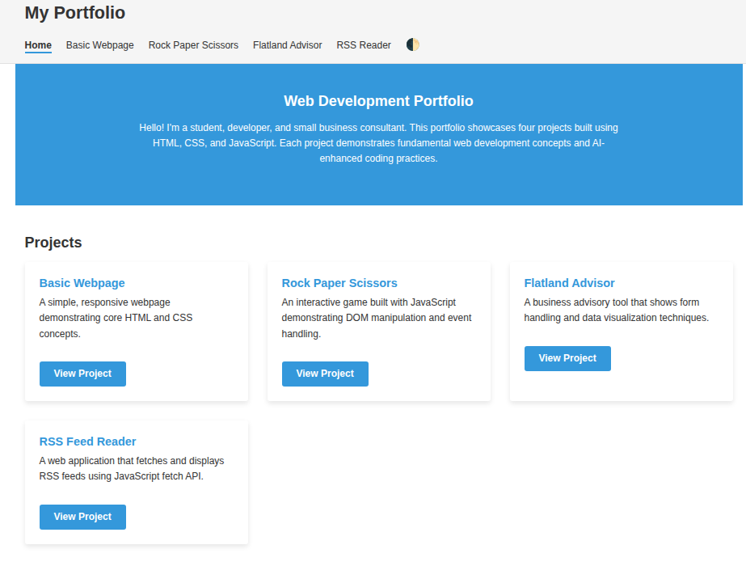

# Portfolio Fusion: AI-Assisted Web Development

## Project Overview

This repository contains a model solution for the ISYS3004 Business Web and Mobile Technologies course assignment. It demonstrates a responsive, accessible portfolio website built using vanilla HTML, CSS, and JavaScript.

The portfolio showcases four web development projects embedded within a modern, responsive interface that adheres to WCAG 2.1 AA accessibility standards.

### Live Demo

[View the live demo](https://web-portfolio-fusion.netlify.app/) 

 

## Features

- **Responsive Design**: Mobile-first approach that adapts to all screen sizes
- **Accessibility**: Fully compliant with WCAG 2.1 AA standards
- **Semantic HTML**: Proper document structure with appropriate HTML5 elements
- **Modern CSS**: Flexbox and Grid layouts with CSS variables for theming
- **Vanilla JavaScript**: Clean, framework-free interactive features
- **High Contrast Mode**: Toggle for users who need enhanced contrast
- **Project Embedding**: Four embedded projects that function within the portfolio

## Project Structure

```
portfolio-site/
├── index.html              # Homepage with project cards
├── basic.html              # Basic Webpage project page
├── rps.html                # Rock Paper Scissors project page
├── flatland.html           # Flatland Business Advisor project page
├── rss.html                # RSS Reader project page
├── style.css               # Main stylesheet
├── scripts.js              # JavaScript functionality
├── basic/                  # Basic Webpage project files
├── rps/                    # Rock Paper Scissors project files
├── flatland/               # Flatland Business Advisor project files
├── rss/                    # RSS Reader project files
├── docs/                   # Documentation files
│   ├── assignment.pdf      # Original assignment specification
│   └── portfolio-design-guide.md  # Implementation guide and explanation
├── LICENSE                 # MIT license file
└── README.md               # This file
```

## Technologies Used

- **HTML5**: Semantic markup for structure
- **CSS3**: Modern styling including:
  - Custom properties (CSS variables)
  - Flexbox and Grid layouts
  - Media queries for responsive design
- **JavaScript**: Vanilla JS for:
  - Mobile navigation toggle
  - High contrast mode with localStorage persistence
  - Accessibility enhancements

## Setup and Installation

This project requires no build tools or package managers. To run it locally:

1. Clone the repository:
   ```
   git clone https://github.com/your-username/portfolio-fusion.git
   ```

2. Open any HTML file in a browser, or use a local development server:
   - Using Python:
     ```
     # Python 3
     python -m http.server
     ```
   - Using Node.js:
     ```
     # With npx (comes with npm)
     npx serve
     ```

3. Access the site at `http://localhost:8000` (or whichever port your server uses)

## Accessibility Features

The portfolio includes numerous accessibility enhancements:

- **Skip Link**: Allows keyboard users to bypass navigation
- **ARIA Attributes**: Used throughout to improve screen reader support
- **Semantic HTML**: Proper document structure and element usage
- **Keyboard Navigation**: Full keyboard support for all interactions
- **High Contrast Mode**: Toggle for users who need enhanced contrast
- **Focus Styling**: Clear visual indicators of focused elements

## Educational Resources

This repository includes learning materials to help understand the implementation:

- [Portfolio Design Guide](docs/portfolio-design-guide.md): Detailed explanation of design decisions, code techniques, and best practices used in this project
- [Assignment Specification](docs/assignment.pdf): Original assignment requirements that this solution addresses

## Learning Goals Demonstrated

This project demonstrates:

1. Responsive web design principles
2. Web accessibility implementation
3. CSS layout systems (Flexbox and Grid)
4. JavaScript for progressive enhancement
5. Mobile-first development approach
6. Modern CSS techniques including custom properties
7. Semantic HTML and ARIA for accessibility

## Usage as a Teaching Resource

This repository is designed to serve as a learning resource for students after completing their own portfolio projects. It demonstrates one approach to implementing the assignment requirements and can be used to:

- Compare different implementation strategies
- Study accessible design patterns
- Understand responsive design techniques
- Learn CSS architecture principles
- Examine clean JavaScript organization

## License

This project is licensed under the MIT License - see the [LICENSE](LICENSE) file for details.

Students and educators are welcome to use, modify, and distribute this code for educational purposes. Attribution is appreciated but not required. However, students should not submit this code as their own academic work without significant modification and proper attribution.

## Acknowledgments

- ISYS3004 teaching team for the assignment specifications
- Created as a model solution for educational purposes

---

*Note: This README is part of an educational resource for the ISYS3004 course at your institution. The solution was created after the assignment due date to serve as a learning tool.*
